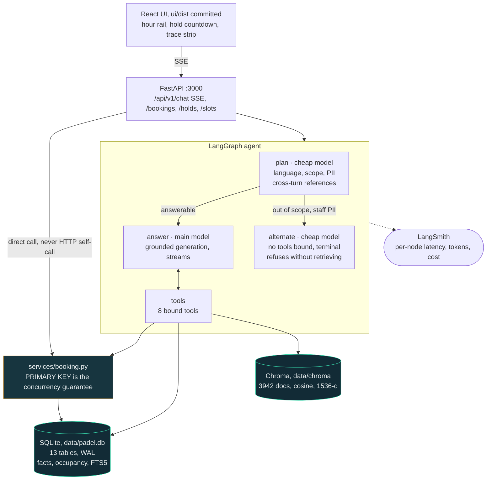
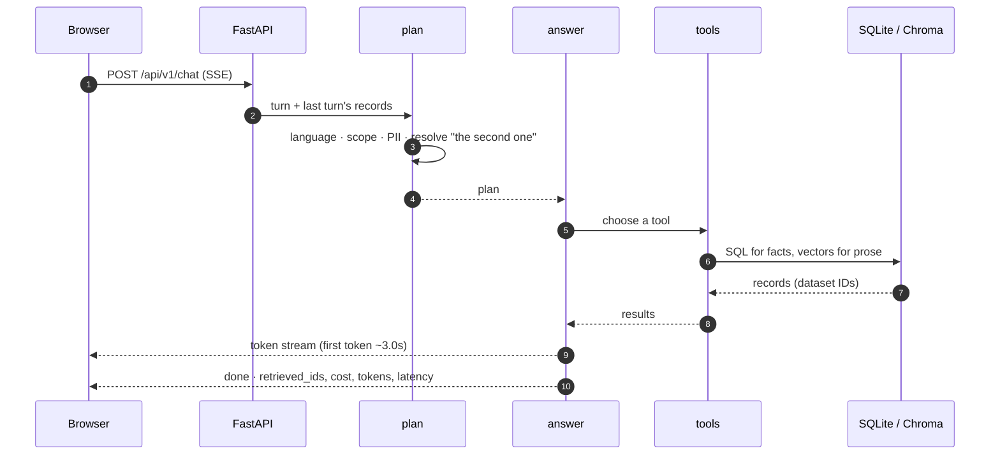
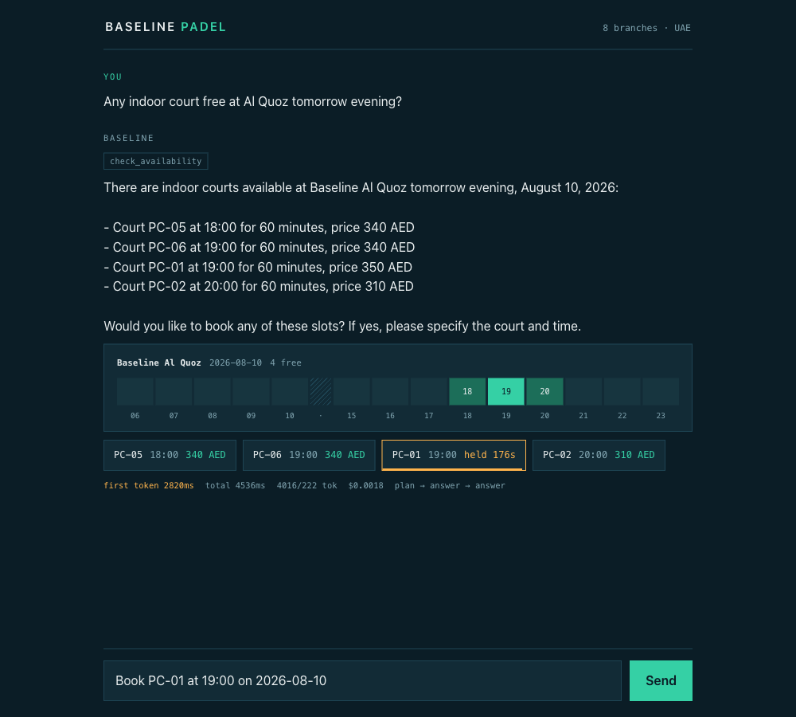
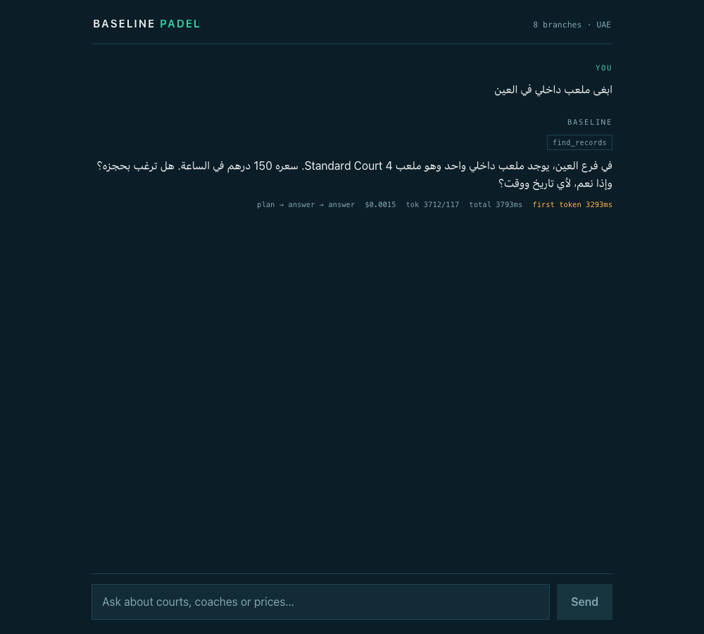

# Baseline Padel — booking and discovery assistant

A grounded conversational assistant over eight fictional padel branches in the UAE.
Answers in English and Arabic, books courts through conversation, and stays correct
under concurrent load.

- [Quick start](#quick-start) · [Results](#results) · [Architecture](#architecture)
- [Data stores](#data-stores) · [Design decisions](#design-decisions) · [What the data made us decide](#what-the-data-made-us-decide)
- [The six challenge areas](#the-six-challenge-areas) · [Measured and rejected](#measured-and-rejected) · [Observability](#observability)

---

## Quick start

Requires **Python 3.12**. Node is **not** needed — the UI ships pre-built.

```bash
python3.12 -m venv .venv && source .venv/bin/activate
pip install -r requirements.txt && uvicorn app.main:app --port 3000
```

Open **http://localhost:3000**.

> **Port 3000, not 8000.** `tests/race.sh` defaults to `BASE_URL=http://localhost:3000`,
> so serving there means the race test runs with no environment variables at all.

First start builds `data/padel.db` from the shipped JSON in under a second. Model calls
need a key: copy `.env.example` to `.env` and set `OPENAI_API_KEY`. Without one the app
still starts — lexical search, availability, pricing and booking all keep working; only
the conversational layer needs a model.

| Task | Command |
| --- | --- |
| Build the semantic index (~$0.012, one off) | `python -m app.ingest --reset` |
| Run the eval | `python -m app.eval --input eval/queries.json --output eval/results/latest.json` |
| Five-query smoke run (~7 s) | `python -m app.eval --input eval/demo_queries.json --output eval/results/demo.json` |
| Score a run | `python -m app.score --results eval/results/latest.json --gold eval/gold.json` |
| Race test | `python -m app.ingest --reset` then `SLOT_ID=slot_alquoz_pc01_20260810_1800 bash tests/race.sh` |
| Tests (49) | `python -m pytest tests/ -q` |

The eval harness **starts what it needs itself** — no server required. `--input` accepts
any path. Output is exactly the contract shape:
`[{query_id, retrieved_ids, answer, refused, latency_ms, cost_usd}]`.

`--reset` before the race matters: the test books the slot, so a second run against an
unreset database correctly returns twenty conflicts and reports FAIL. Reset takes under
a second and is safe while the server is running.

---

## Results

47 queries — 14 Arabic or mixed, 5 multi-turn — across answerable, partially answerable
and unanswerable.

Figures below are the min–max across **three consecutive runs** of the shipped
configuration, not a single best run.

| Metric | Result | Target |
| --- | --- | --- |
| Retrieval recall | 0.95–0.98 | — |
| Precision@1 / MRR | 0.60–0.70 / 0.70–0.78 | — |
| Refusal accuracy | **0.957** (45/47) | scored both directions |
| PII leaks | **0** | 0 ✅ |
| Mean cost per query | **$0.0023** | ≤ $0.02 ✅ |
| p95 full response | 5.1–8.8 s | ≤ 8 s passes in 2 of 3 |
| Time to first token | 3.0 s median · 4.2 s p95 | ≤ 2 s ❌ |
| Race test | 1 confirmation, 19 rejections, 5/5 runs | exactly 1 ✅ |

**The two refusal errors are known and named.** `q31` — "do you have a pool or a gym?" —
misses in every run: the planner sets `out_of_scope` on the strength of the pool, the
request is routed to the tool-less `alternate` node, and the answerable gym half is lost
with it. That is the standing cost of refusing early, and the fix belongs in the planner
learning to separate *"part of this is out of scope"* from *"none of this can be
served"*, which four prompt attempts have not achieved in Arabic. The second error moves
between runs (`q08`, or `q36` as a missed refusal) and is phrasing noise in the refusal
detector rather than a behaviour change.

---

## Architecture



### A request, end to end



Two orderings in `app/main.py` are load-bearing: the API router is registered **before**
the static mount, or `StaticFiles` at `/` swallows `/api/*`; and everything expensive
happens in **lifespan**, so the first booking request never pays initialisation cost.

---

## Data stores

### SQLite — `data/padel.db`

Built at startup from the shipped JSON, never committed. WAL, `synchronous=NORMAL`,
`busy_timeout=5000`, one connection per request. Dataset IDs are the primary keys
everywhere, because the eval contract compares `retrieved_ids` against a key built on
them.

**Catalog and structured data** — loaded verbatim from `catalog/` and `structured/`:

| Table | Rows | Notes |
| --- | ---: | --- |
| `branches` | 8 | `coordinates` flattened to `lat`/`lng`; `br_rak` has none |
| `courts` | 60 | `code` unique only *within* a branch — `SC-01..03` appear at all 8 |
| `coaches` | 45 | `internal_phone` / `internal_email` stored but never leave retrieval |
| `classes` | 120 | `schedule` is free text; `max_age` null in 89 |
| `packages` | 80 | `status` says `active` for all 80, including 15 expired |
| `policies` | 40 | ~10 KB bodies, chunked by numbered section for search |
| `reviews` | 3,120 | `is_noise` flags injected HTML, boilerplate and duplicates |
| `slots` | 12,600 | 60 courts × 15 days × 14 hours; `price_aed` is authoritative |
| `price_rules` | 120 | `multiplier` is sound and quoted to users; `price_aed` is not — 86/120 disagree with their own arithmetic |
| `coach_schedules` | 600 | of a possible 675; absence means unknown, not free |
| `bookings` | 4,000 | seeded, plus everything created at runtime |

**Occupancy** — the tables that make booking correct:

| Table | Rows | Purpose |
| --- | ---: | --- |
| `slot_claims` | 3,995 | One row per occupied slot. `slot_id TEXT PRIMARY KEY`, `STRICT`, `WITHOUT ROWID`. Seeded as 3,845 bookings + 150 blocked. `kind` is `booking` \| `hold` \| `blocked`; `expires_at` is unix epoch seconds for holds. |
| `slot_overhang` | 565 | The unmarked second hour of legacy 90-minute bookings. Consulted on **writes only**, never on reads. |

```sql
CREATE TABLE slot_claims (
  slot_id    TEXT PRIMARY KEY,   -- the constraint that does all the work
  kind       TEXT NOT NULL,      -- 'booking' | 'hold' | 'blocked'
  booking_id TEXT,
  session_id TEXT,
  expires_at INTEGER             -- unix epoch seconds; holds only
) STRICT, WITHOUT ROWID;
```

`WITHOUT ROWID` is load-bearing, not stylistic: **a plain `TEXT PRIMARY KEY` on a rowid
table accepts `NULL`**, which would silently allow unlimited null claim rows. Verified
locally before relying on it.

Eight indexes; the one that matters is `idx_slots_court_date_time` on
`(court_id, date, start_time)` — unique across all 12,600 rows — which makes the
`+60 min` adjacency lookup exact and index-backed.

### FTS5 — `docs_fts`

A virtual table over the same prose that goes to Chroma. Free with stdlib `sqlite3`, and
it doubles as the fallback when the vector store or embedding provider is unavailable.

```sql
CREATE VIRTUAL TABLE docs_fts USING fts5(
  record_id UNINDEXED, type UNINDEXED, branch_id UNINDEXED, title, body
);
```

User text is sanitised before `MATCH` — FTS5 is a query language, so raw input is a
syntax error waiting to happen.

### Chroma — `data/chroma`

One persistent collection, `padel`, cosine distance, 1,536-dimensional
`text-embedding-3-small` vectors supplied explicitly so Chroma never downloads its
default ONNX model.

| Field | Value |
| --- | --- |
| Chunk ID | `{record_id}#{n}` — internal only |
| `metadata.record_id` | **the dataset's own ID**, what makes `retrieved_ids` compliant |
| `metadata.type` | `branch` · `court` · `coach` · `class` · `package` · `policy` · `review` |
| `metadata.branch_id` | for branch-filtered search |
| `metadata.title` | display label |
| Document | `"{title}\n{body}"` |

**3,942 documents**, and the mix explains two design choices:

| Type | Docs | From |
| --- | ---: | --- |
| `policy` | 558 | 40 policies, chunked by numbered section (~10 KB each) |
| `review` | 3,071 | 3,120 reviews, minus 49 duplicates and injected noise |
| `class` | 120 | |
| `package` | 80 | |
| `court` | 60 | |
| `coach` | 45 | bios only — contact fields excluded from the index |
| `branch` | 8 | |

Reviews are **79 % of the corpus**, so searching everything at once buried the record
that actually answered the question. They are now retrieved as a capped second pass and
treated as supporting evidence.

---

## Design decisions

**Retrieval splits by question shape.** Prose questions ("somewhere relaxed for beginners
with kids") go through Chroma and FTS5 fused with Reciprocal Rank Fusion. Facts ("is
PC-07 free tomorrow at 7", "cheapest branch in the evening", "how many coaches in Ajman")
are SQL. A vector store cannot count, compare prices or read a calendar; embedding those
questions would be slower, dearer and wrong.

**Booking correctness is a database constraint, not application logic.** Twenty
concurrent writers all attempt the same `INSERT` into `slot_claims`; SQLite lets exactly
one through and raises `IntegrityError` for the rest. Nothing depends on a Python lock,
so the guarantee survives multiple workers and processes.

- Per-request connections with `BEGIN IMMEDIATE`, never a shared connection: one escaped
  exception on a shared connection leaves it inside an open transaction and *every*
  subsequent booking fails.
- Never `INSERT OR IGNORE` (would commit a partial 90-minute booking) or `OR REPLACE`
  (would steal a slot from an existing booking).
- Errors discriminated by `sqlite_errorcode`, not string matching.
- Handlers are plain `def`, so blocking SQLite runs in the threadpool instead of freezing
  the event loop.
- `SQLITE_BUSY` → bounded retry → **409**, never a 5xx.

**The agent sits on top of booking, never beside it.** The chat tool imports
`services.booking` directly. An HTTP self-call from a node already in the threadpool
would consume two limiter tokens per booking and can deadlock under concurrency.
Tool retries carry an optional idempotency key so a retried call returns the original
booking rather than making a second one.

**Models are addressed by role, not vendor.** `LLM_PLANNER`, `LLM_RERANKER`,
`LLM_ANSWERER`, `LLM_FALLBACK` each take a `provider:model` string, so swapping a
component's model — or its provider — is one line of `.env`. Built on
`init_chat_model`, which LangGraph already brings, so it adds no dependency.

**Everything tunable lives in `app/config.py`**, environment-driven: hold TTL, top-k, the
RRF constant, busy timeout, allowed durations, per-model prices, and the reference date.

**Errors never leak internals.** Provider exceptions are logged in full and reported to
the user as a plain sentence.

---

## What the data made us decide

**The reference date is the dataset's, not the clock's.** Availability runs 2026-08-10 to
2026-08-24 against a reference date of 2026-08-09. "Tomorrow" resolves from
`dataset_meta.json`, so the eval behaves identically whatever day you run it.

**The slot grid has a hole.** Courts run 06:00–10:00 and 15:00–23:00 — no 11:00–14:00
slots exist, though `opening_hours` claims 06:00–00:00. Adjacency is therefore a real
`+60 min` step on the same court and date, never the next row in sort order. A 90-minute
booking starting at 10:00 does not fit and returns 400. The UI draws the gap rather than
smoothing it away.

**`slots.price_aed` is the only trustworthy price.** `courts.price_per_hour_aed` has 5
nulls and 2 sentinel `99999` values; `price_rules.price_aed` disagrees with its own
`base × multiplier` in 86 of 120 rows and omits Al Ain indoor entirely.

**The band multipliers are the salvageable half of `price_rules`.** The `multiplier`
column is uniform across every branch and court type — morning `0.75`, afternoon `0.9`,
evening `1.25`, late `0.85` on a weekday, and `0.862 / 1.035 / 1.438 / 0.977` at the
weekend — so the Al Ain indoor gap costs nothing. Weekend here means **Friday and
Saturday**: reconciling the 11,130 slots that have a usable court base, Fri/Sat leaves 16
disagreements against Sat/Sun's 2,976. `price_summary` returns those multipliers so the
agent can answer *why* an hour is priced as it is, and a test re-runs the reconciliation
so we stop quoting the ratio the day the grid stops obeying it.

**The 90-minute overhang.** 565 seeded bookings declare `duration_min: 90` while
referencing a single 60-minute slot; the second hour is unmarked and 63 of those
neighbours are already blocked. We report availability exactly as the dataset states it —
claiming those hours would silently flip 502 slots the data calls available, against a
key built on those records — and enforce the overhang on the **write** path so no new
booking can take a physically occupied hour. A new 90-minute booking claims two
contiguous slots and is priced at **1.5×, not 2×**.

**Refusals are judged on behaviour, not intent.** "We hold no information about that" is
a refusal; "there is nothing free at that time" and "no, billing is not by instalment"
are answers. Markers count only in the opening sentence, availability negatives are
answers, and scope is decided by the planner rather than string matching.

**Staff contact details never leave the retrieval layer.** `internal_phone` and
`internal_email` exist for all 45 coaches, are stripped from every record and excluded
from both indexes. Branch phone numbers are public and are shared.

**Language detection is a regex, not a model output.** Asking the model to report the
language labelled Arabic questions `"en"`, which then told the answer step to reply in
English. A script check cannot get that wrong.

**Dirty data handled at ingest.** Reviews carry injected HTML, session-timeout
boilerplate and duplicate bodies; those rows are kept — their IDs may be in the graders'
key — but flagged out of the search index. Two dates are unparseable (`2026-13-07` and
`2026-02-30`) and are stored as NULL rather than crashing the load.

---

## The six challenge areas

| # | Area | Implementation and evidence |
| --- | --- | --- |
| 1 | **Slot holds** | `kind='hold'` with an integer-epoch TTL in the same claims table. Expiry is a *scoped* delete of only the requested slots inside the write transaction; a global sweep runs at startup. Confirming converts the hold in one transaction, and a session booking a slot it already holds converts rather than conflicting with itself. The UI drains a countdown bar on the held chip. One request may cover at most **8 slots** (`booking_max_slots_per_request`, against a largest real slate of 4 courts): `/chat` is unauthenticated and `create_hold` otherwise accepted 200 slots in a single call, enough to take the estate off the market. |
| 2 | **Cross-turn references** | The session keeps the last ranked result list; the planner resolves "the second one", "the first one" or "same time at Yas" into concrete IDs before retrieval. Records carried from an earlier turn count as retrieved, because they are what grounds the answer. 5 multi-turn eval cases (q39–q43, two Arabic) + unit tests. |
| 3 | **Graceful degradation** | Chroma down → FTS5 lexical, flagged. Reranker or planner down → the turn still answers. Provider down → configured fallback vendor, exercised with a real primary outage. Booking and all structured lookups are pure SQL and need no model. 8 tests, each removing a real dependency. |
| 4 | **Cost reduction** | **$0.0023/query, ~9× under target.** Planner moved to the smallest model, prose in tool payloads capped (six policy bodies had pushed one call past 9,000 input tokens), reviews retrieved as a capped second pass. Measured before/after: $0.00312 → $0.00210 with recall improving. A request the planner has already ruled out skips retrieval and the expensive model entirely via `alternate`, which costs ~$0.00013 against ~$0.00096 on the tool path. |
| 5 | **Multi-constraint booking** | `find_group_slots` handles party size → courts (4 players each), simultaneity, adjacency and coach cover, and a group is held and booked **atomically across every court**. 4 eval cases (q44–q47) and 14 tests. Both soft constraints are surfaced as **caveats rather than asserted**: the data records no court positions and does not link coaches to bookings. |
| 6 | **Reranking** | Built, measured, **does not help here** — see below. Ships disabled. |

---

## Measured and rejected

Two things were built properly, measured, and then turned off because the evidence said
so. Both are one environment variable away for anyone who wants to re-measure.

### Reranking — [`eval/RERANKING.md`](eval/RERANKING.md)

Challenge 6 asks for a reranking stage demonstrated to improve results. It does not.

| Configuration | Recall | P@1 | MRR | Cost | p95 |
| --- | ---: | ---: | ---: | ---: | ---: |
| **Hybrid + RRF, no rerank** | **1.000** | **0.789** | **0.835** | **$0.00205** | **7598 ms** |
| \+ LLM rerank, 240-char parent snippet | 1.000 | 0.737 | 0.800 | $0.00224 | 8393 ms |
| \+ LLM rerank, 480-char parent snippet | 0.987 | 0.737 | 0.800 | $0.00240 | 9171 ms |
| \+ LLM rerank, **matched chunk** | 0.975 | **0.650** | **0.717** | $0.00227 | 6439 ms |

Recall alone saturates at a generous *k*, so precision@1 and MRR were added to detect
ranking quality at all.

The fourth row is the informative one. The suspected weakness was that the reranker
judged policies on the parent record's opening rather than the passage that matched, so
it was given the matched chunk instead — and got **worse**. The matched chunk is by
construction what the *embedder* liked most, so feeding it back re-derives the semantic
ranking and the lexical half of the ensemble stops counting.

Which reframes the finding: **the value here is the ensemble, not the ranking model.**
RRF works because its two inputs fail in uncorrelated ways; any single model re-reading
the candidates replaces two opinions with one. The promising direction is not a better
reranker but a *third* retriever in the fusion.

### The TTFT refactor — [`docs/LATENCY.md`](docs/LATENCY.md)

Time to first token is the one target still missed, so planning was re-expressed as a
`note_plan` tool emitted alongside the first retrieval call, collapsing three model round
trips into two. It works, and it is worse on every axis:

| | 3 calls (shipped) | 2 calls (merged) |
| --- | ---: | ---: |
| Refusal accuracy | **1.000** | 0.979 |
| Precision@1 / MRR | **0.75 / 0.803** | 0.70 / 0.753 |
| Cost per query | **$0.00212** | $0.00274 (+29 %) |
| TTFT p95 | **4152 ms** | 5288 ms |
| Total p95 | **5822 ms** | 6633 ms |

---

## Observability

Set `LANGSMITH_TRACING=true` and `LANGSMITH_API_KEY` in `.env`. Every node is traced with
step, latency, input and output tokens, and cost. Tracing is opt-in and the app boots
fine without it; no module reads an API key at import time.

An **EU-region key needs `LANGSMITH_ENDPOINT=https://eu.api.smith.langchain.com`**. The
SDK defaults to the US host, which rejects an EU key with a 403 that only ever reaches
the log — requests keep returning 200 while every trace is silently dropped.

Dashboard: <https://smith.langchain.com> → project `baseline-padel`. A captured
breakdown of a real request is in [`docs/TRACING.md`](docs/TRACING.md):

| Step | Type | Latency | Input tok | Output tok | Cost |
| --- | --- | ---: | ---: | ---: | ---: |
| `LangGraph` (whole turn) | chain | 5502 ms | 4220 | 155 | $0.001217 |
| ├─ `plan` | chain | 2560 ms | 450 | 71 | $0.000073 |
| ├─ `answer` (choose tool) | chain | 1423 ms | 1967 | 45 | $0.000360 |
| ├─ `tools` → `check_availability` | tool | 33 ms | — | — | — |
| └─ `answer` (generate) | chain | 1364 ms | 1803 | 39 | $0.000784 |

The same numbers are computed locally per request and returned on the `done` SSE event
and in the eval output, so `cost_usd` can be checked against the dashboard rather than
taken on trust. Costs come from `usage_metadata` against an env-overridable price table.



The hour rail is the availability grid as it actually is — 06–10, a real break, then
15–23. Teal hours are free and clickable, the amber chip is a live hold counting down,
and the trace strip carries the per-response numbers, turning amber when TTFT exceeds
its target rather than hiding the miss.



---

## Layout

```
app/
  main.py            lifespan, router-before-static, 422→400
  config.py          all configuration, one place, env-driven
  db.py              connection, PRAGMAs, write_txn(), schema
  ingest.py          JSON → SQLite + Chroma          (python -m app.ingest)
  llm.py             role→model resolution, cost and latency ledger, fallback
  eval.py            harness                         (python -m app.eval)
  score.py           grading                         (python -m app.score)
  api/               bookings.py · slots.py · chat.py (SSE)
  services/          booking.py · retrieval.py · vectorstore.py
  agent/             graph.py · tools.py
eval/                queries.json · gold.json · RERANKING.md · results/
tests/               race.sh (provided) · test_booking.py · test_degradation.py · test_agent.py
docs/                LATENCY.md · TRACING.md · ASSESSMENT.md · screenshots
ui/                  Vite React source; ui/dist is committed
```

The original assessment brief is preserved at [`docs/ASSESSMENT.md`](docs/ASSESSMENT.md);
the plan this was built from is in [`plan.md`](plan.md).

---

## Known gaps

- **Time to first token is ~3 s against a 2 s target.** Measured, and the one
  architectural alternative was tried and rejected on evidence. The remaining untried
  lever is a smaller model for the tool-selection call only.
- **Reranking is implemented but disabled**, because four measurements say it hurts.
- **Cross-encoder reranking** remains untried: it needs `torch` and several hundred MB
  against a clean-clone install requirement, and on the evidence above it would likely
  lose for the same reason — still one opinion replacing two.
- All six challenge areas were attempted. The brief's own advice is that three developed
  thoroughly beats six covered superficially, and that is a fair thing to weigh.
